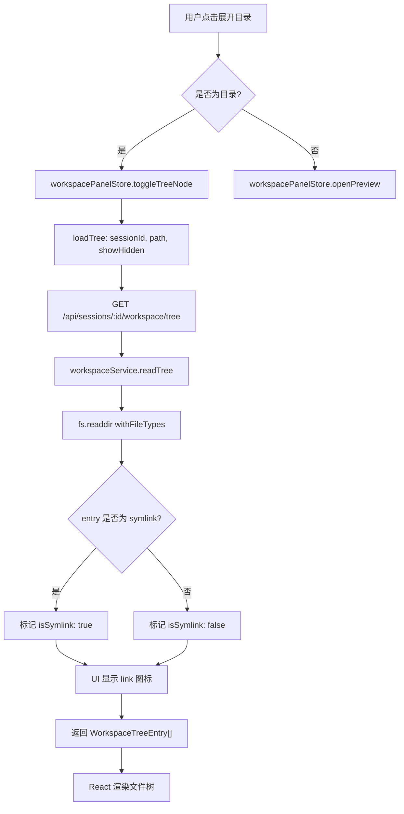
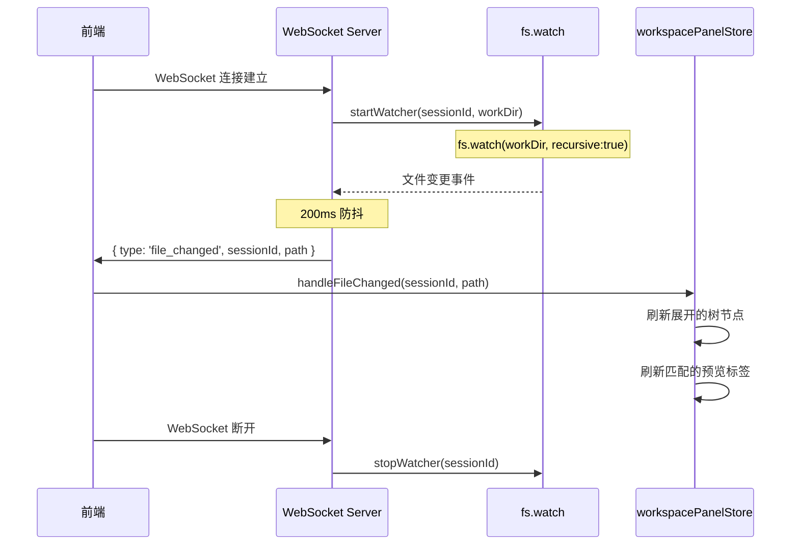
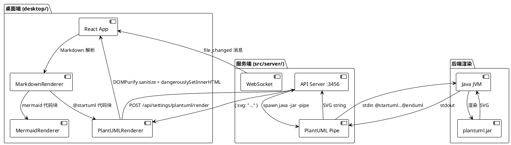
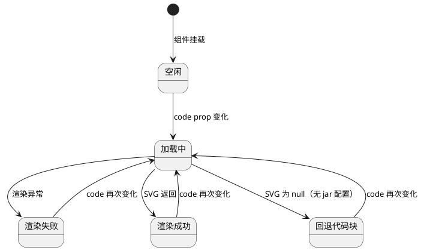

# 功能集成测试文档

> 本文档用于验证 `feature/workspace-enhancements` 分支的全部新增功能：
> 隐藏文件控制、软连接显示、Mermaid 流程图、PlantUML 图表、KaTeX 公式渲染。

---

## 一、Mermaid 流程图

### 1.1 文件树加载流程



### 1.2 文件监听流程



---

## 二、PlantUML 图表

### 2.1 系统架构图



### 2.2 组件生命周期



---

## 三、KaTeX 公式渲染

### 3.1 行内公式

爱因斯坦质能方程：$E = mc^2$

欧拉公式：$e^{i\pi} + 1 = 0$

二次方程求根公式：$x = \frac{-b \pm \sqrt{b^2 - 4ac}}{2a}$

### 3.2 块级公式

**贝叶斯定理：**

$$
P(A|B) = \frac{P(B|A) \cdot P(A)}{P(B)}
$$

**傅里叶变换：**

$$
\hat{f}(\xi) = \int_{-\infty}^{\infty} f(x) \cdot e^{-2\pi i x \xi} \, dx
$$

**矩阵乘法复杂度分析：**

$$
C_{i,j} = \sum_{k=1}^{n} A_{i,k} \cdot B_{k,j} \quad \Rightarrow \quad O(n^3)
$$

**梯度下降更新规则：**

$$
\theta_{t+1} = \theta_t - \eta \cdot \nabla_{\theta} J(\theta_t)
$$

---

## 四、代码块展示

### 4.1 TypeScript — 软连接检测

```typescript
// src/server/services/workspaceService.ts
export type WorkspaceTreeEntry = {
  name: string
  path: string
  isDirectory: boolean
  isSymlink: boolean
}

function readTree(sessionId: string, relativePath = '', showHidden = false) {
  const entries = await fs.readdir(resolvedPath, { withFileTypes: true })
  return entries
    .filter(filterByShowHidden(showHidden))
    .sort(directoriesFirst)
    .map((entry) => ({
      name: entry.name,
      path: buildRelativePath(entry),
      isDirectory: entry.isDirectory(),
      isSymlink: entry.isSymbolicLink(),
    }))
}
```

### 4.2 React 组件 — PlantUML 渲染

```tsx
// desktop/src/components/chat/PlantUMLRenderer.tsx
export function PlantUMLRenderer({ code }: Props) {
  const [svg, setSvg] = useState<string | null>(null)
  const [loading, setLoading] = useState(true)
  const [error, setError] = useState<string | null>(null)

  useEffect(() => {
    api.post('/api/settings/plantuml/render', { code })
      .then((result) => {
        if (result.svg) {
          setSvg(DOMPurify.sanitize(result.svg, {
            ADD_TAGS: ['foreignObject'],
            USE_PROFILES: { svg: true, svgFilters: true },
          }))
        }
      })
      .catch((e) => setError(e.message))
      .finally(() => setLoading(false))
  }, [code])

  if (loading) return <LoadingSpinner />
  if (error) return <ErrorBanner message={error} />
  if (!svg) return <CodeViewer code={code} language="plantuml" />
  return <div dangerouslySetInnerHTML={{ __html: svg }} />
}
```

### 4.3 Shell 脚本 — 启动命令

```bash
#!/usr/bin/env bash
# docs/script/start-dev.sh — 一键启动开发环境

SERVER_PORT=3456

echo "==> 启动后端..."
bun run src/server/index.ts &
SERVER_PID=$!

sleep 2

echo "==> 启动前端..."
cd desktop && bun run dev &
DESKTOP_PID=$!

# 清理
trap "kill $SERVER_PID $DESKTOP_PID" EXIT
wait
```

---

## 五、软连接测试

本目录下包含两个软连接，用于验证文件树的 `isSymlink` 显示功能：

| 软连接 | 目标 |
|--------|------|
| `symlink-summary` | `~/工作总结` |
| `symlink-ai-summary` | `~/个人总结/AI使用总结/ai使用分析/中英文 思维链对比分析_20260511.md` |

> 在文件树中展开本目录，软连接条目旁应显示 `🔗` 图标。
  